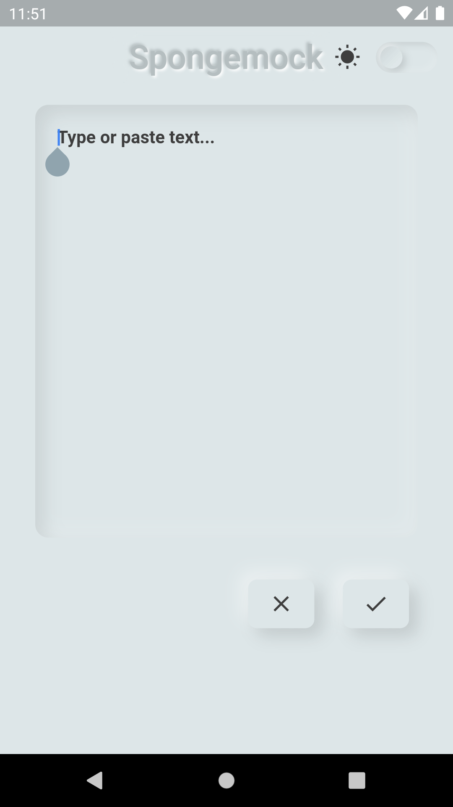
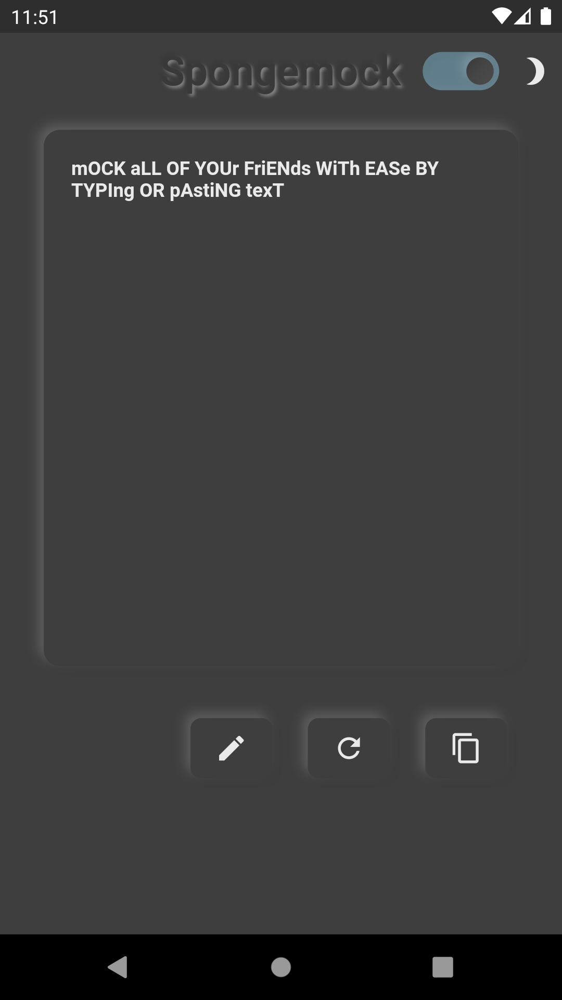

# spongemock_flutter

A Flutter project for translating text to [spongemock language](https://knowyourmeme.com/memes/mocking-spongebob).

## Building
### Build APK
```console
foo@bar: ~$ cd /path/to/project
foo@bar: ~$ flutter build apk
```

### Run
```console
foo@bar: ~$ cd /path/to/project
foo@bar: ~$ flutter run
```

## Download
<a href="https://play.google.com/store/apps/details?id=com.sharpsan.spongemock">
    
</a>
<br /><br/>
<table>
    <tr>
        <td>
            <a href='github_resources/screenshots/v1.0.0/Screenshot_1586753480.png'>
                
            </a>
        </td>
        <td>
            <a href='github_resources/screenshots/v1.0.0/Screenshot_1586753462.png'>
                
            </a>
        </td>
        <td>
            <a href='github_resources/screenshots/v1.0.0/Screenshot_1586753469.png'>
                
            </a>
        </td>
        <td>
            <a href='github_resources/screenshots/v1.0.0/Screenshot_1586753484.png'>
                
            </a>
        </td>
        <td>
            <a href='github_resources/screenshots/v1.0.0/Screenshot_1586753464.png'>
                
            </a>
        </td>
    </tr>
</table>
